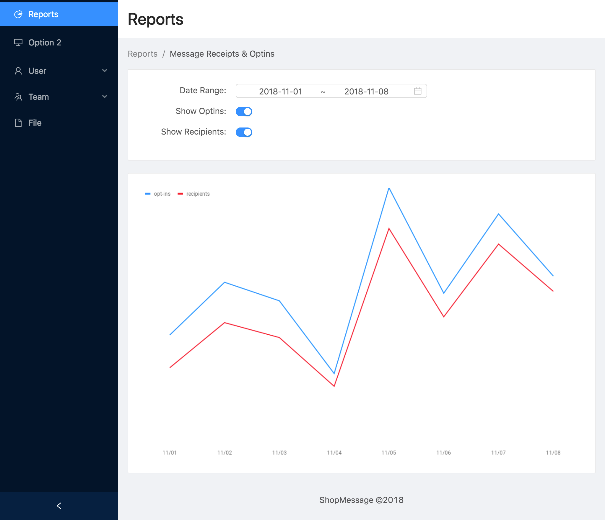

ShopMessage Assignment for React Developer
==========================================
Finish the implementation of this reports dashboard by building a chart that users can manipulate by selecting dates and fields to render. The resulting implementation should look something like the interface below and has the following features:

- User can select a start and end date for which to show data.
- The "Optins" and "Recipeints" datasets are shown in the same chart. The X-axis represents calendar days.
- User can hide or reveal the "Optins" dataset from the chart.
- User can hide or reveal the "Recipients" dataset from the chart.



Instructions
------------
Clone this repository as a starting point
```
$> git clone https://github.com/fanrock/shopmsg-chart-demo.git --depth 1
```

Install the dependencies onto your local development environment.

```
$> npm install
```

If you are using [VisualStudio Code](https://code.visualstudio.com/), I have included a `.vscode/launch.json` file for you to begin debugging. Otherwise start the development server with `npm`.
```
$> npm start
```

You should be able to implement your solution using strict browser-only code in Typescript and/or Javascript. Write the code that you need in the `/client` directory.

Resources
---------
To retrieve the dataset for optins, the server code in this repo exposes two JSON endpoints:

- `/api/reports/optins.json?from={YYYY-MM-DD}&to={YYYY-MM-DD}`
- `/api/reports/recipients.json?from={YYYY-MM-DD}&to={YYYY-MM-DD}`

The result is a JSON array:
```
[
  {
    "date": "10/01",
    "count": 482
  },
  {
    "date": "10/02",
    "count": 517
  },
  {
    "date": "10/03",
    "count": 504
  },
  {
    "date": "10/04",
    "count": 513
  },
  {
    "date": "10/05",
    "count": 476
  },
  {
    "date": "10/06",
    "count": 485
  },
  {
    "date": "10/07",
    "count": 514
  },
  {
    "date": "10/08",
    "count": 517
  },
  {
    "date": "10/09",
    "count": 511
  },
  {
    "date": "10/10",
    "count": 488
  },
  ...
]
```

You may choose to use any package available in the NPM repository. Though we are already using [Ant Design](https://ant.design/) and you are encouraged to keep your UI looking consistent with the existing code.

Deliverables
------------
**Code** - Upload your code to your own personal github account and send us a link to your completed implementation when finished.

**Deployment** - _optional_ If you have an account, upload your build to [Heroku](https://www.heroku.com/) or similar cloud hosting provider and send us a link. There is a [free tier](https://www.heroku.com/pricing#heroku-dyno-free) available so you should not have to pay. Make sure to set your `NODE_ENV=production` environment variable in the production environment. 

**Screencast** - Our team really values communication! Please make a screencast where you show us the functionality you implemented. This can be quick (no more than 5 minutes) and casual. If you don't have a tool you currently use to make screencasts, we recommend you use [Loom](https://www.useloom.com/) to make the screencast. It's free and easy to use.
